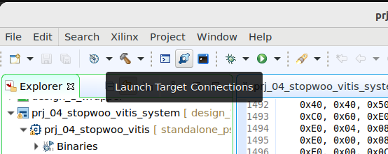
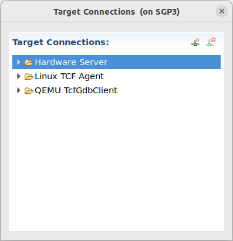
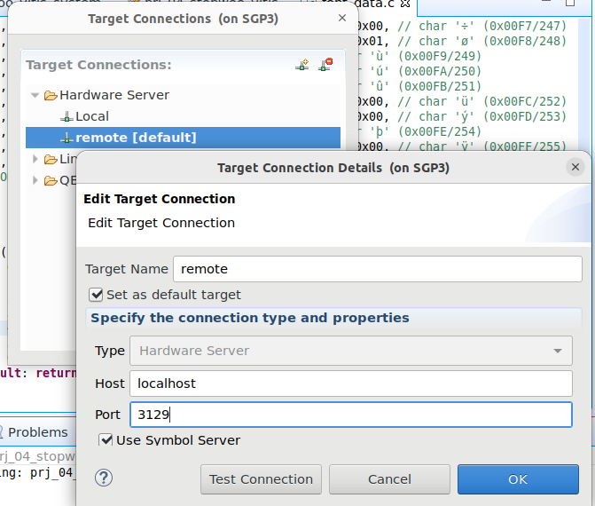
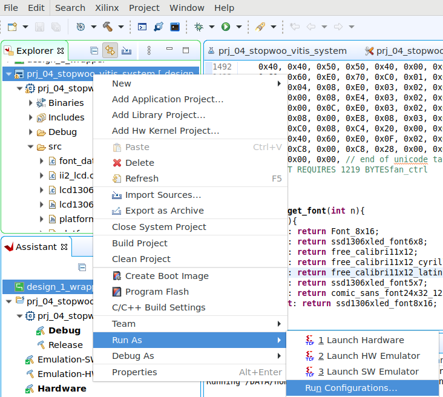
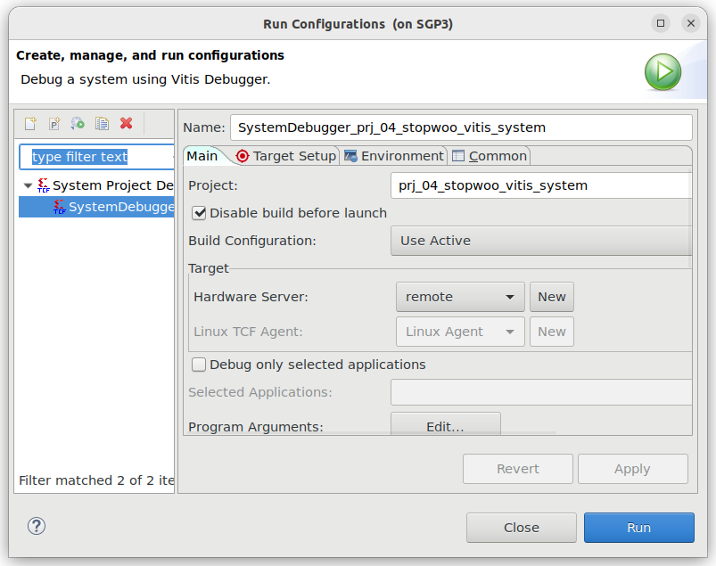

# Vitis working env w/ local board

## Setup remote connection

Vitis가 돌고 있는 server에서 보면 board는 remote pc에 연결되어 있다. 이를 지정해 주는 작업을 선진행한다.

1. `Lauch Target Connection`

    * Remote PC에서 보드연결을 지원하고 있는 `hw_server`를 위한 Target Connection을 추가한다.

    

    

    

    * `Set as default target`은 실 연결 시 효과 없음

2. `Run Configuration`

    * application 실행 시 연결할 `hw_server`를 지정

    

    

3. Run w/ the new `remote HW server`

---
## 주의 사항

1. Local host에서 `hw_server`가 동작 중에는 board 의 `JTAG`을 점유하고 있어서 `xsct`를 이용한 board setting 시 connection 오류가 발생하여 boot mode를 바꿀 수 없다. 따라서 보드의 `bootmode`를 먼저 `JTAG`으로 setting하고 난뒤 `hw_server`를 실행한다.

2. `hw_server`의 port번호는 모든 user에게 고유한 번호를 부여하여 진행한다.
